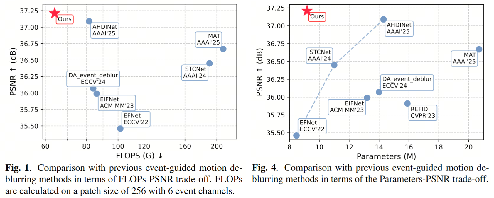

# [ICASSP'26] TRM-UNet: An Efficient Event-Guided Motion Deblurring Network
New state-of-the-art performance on the GoPro dataset while using only 64.1% of the parameters and 78.3% of the FLOPs compared to leading methods.


**The full repo will be released after the conference.**

## Installation

The model is built in PyTorch 2.5.1+cu124 and tested on Ubuntu 20.04 environment (Python 3.10, nvcc 12.8, mamba_ssm 2.2.2).
We use 4 NVIDIA RTX3090s for training. The time for 1 epoch (1000 iterations) is within 55 minutes, including both training and validating.

## Training and Evaluation
### Train
- Download the [GoPro events train/test dataset](https://pan.baidu.com/s/1UKV-sPGo9mRf7XJjZDoF7Q) (code: kmaz) to your data root (provided by AHDINet's author)
- Change both training.yml and config.py to your settings.
- Train the model with default arguments by running

```
 python main_train.py
```
### Evaluation
- Download the [GoPro events test dataset](https://pan.baidu.com/s/1UKV-sPGo9mRf7XJjZDoF7Q) (code: kmaz) to ./Datasets
- Download the [pretrained model](https://drive.google.com/file/d/1NAVTfdbPVsU1MIbuRhS0V4C6BMPzAecJ/view?usp=sharing) to TRM-UNet-512/models/TRM-UNet/model_best.pth
- Test the model with default arguments by running

```
  python main_test.py
```
## Acknowledgement
Thanks to the inspirations and codes from [AHDINet](https://github.com/wyang-vis/AHDINet) and [EVSSM](https://github.com/kkkls/EVSSM/)

## Cite this work (BibTeX)
```
@inproceedings{fan2026trm-unet,
  title={TRM-UNet: An Efficient Event-Guided Motion Deblurring Network},
  author={Fan, Dawei and Tang, Xiongxin and Chen, Qiao and Xu, Fanjiang},
  booktitle={ICASSP 2026-2026 IEEE International Conference on Acoustics, Speech and Signal Processing (ICASSP)},
  pages={1--5},
  year={2026},
  organization={IEEE}
}
```
