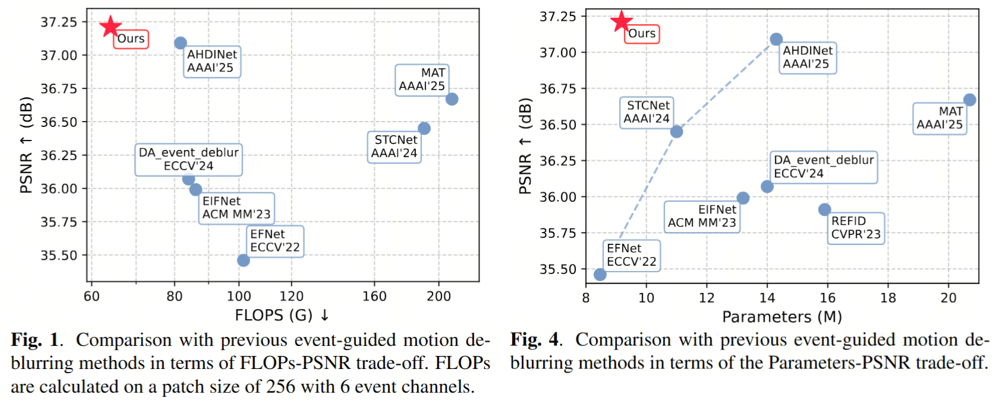

# [ICASSP'26] [TRM-UNet: An Efficient Event-Guided Motion Deblurring Network](https://xplorestaging.ieee.org/document/11462796)

[News] You may also want to check our new updates:

- **Event Deblur Pro (2026.03)** [Code](https://github.com/NikonD850/NTIRE26_event_deblur) 🏆 3rd Place of 2nd Event-based Image Deblurring Challenge

- **REGDSSM (2026.03)** [Code](https://github.com/NikonD850/REGDSSM)  🚩 Accepted by **ICME'26**

TL;DR: New state-of-the-art performance on the GoPro dataset while using only 64.1% of the parameters and 78.3% of the FLOPs compared to leading method AHDINet.



## Installation

The model is built in PyTorch 2.5.1+cu124 and tested on Ubuntu 20.04 environment (Python 3.10, nvcc 12.8, mamba_ssm 2.2.2).
We use 4 NVIDIA RTX3090s for training. The time for 1 epoch (1000 iterations) is within 55 minutes, including both training and validating.

For step-by-step environment setup and **TRAINING SPEED UP**, please follow our [new repository](https://github.com/NikonD850/NTIRE26_event_deblur).

## Training and Evaluation
### Train
- Download the [GoPro events train/test dataset](https://pan.baidu.com/s/1UKV-sPGo9mRf7XJjZDoF7Q) (code: kmaz) to your data root (provided by AHDINet's authors)
- Change both training.yml and config.py to your settings.
- Train the model with default arguments by running

```
 nohup python main_train.py > TRM-UNet-train.log 2>&1 &
```
### Evaluation
- Download the [GoPro events test dataset](https://pan.baidu.com/s/1UKV-sPGo9mRf7XJjZDoF7Q) (code: kmaz) to your data root (provided by AHDINet's authors)
- Download the [pretrained model](https://drive.google.com/file/d/1NAVTfdbPVsU1MIbuRhS0V4C6BMPzAecJ/view?usp=sharing) to TRM-UNet-512/models/TRM-UNet/model_best.pth
- Test the model with default arguments by running

```
  python main_test.py
```
## Acknowledgement
Thanks to the inspirations and codes from [AHDINet](https://github.com/wyang-vis/AHDINet) and [EVSSM](https://github.com/kkkls/EVSSM/)

## Cite this work (BibTeX)
```
@INPROCEEDINGS{11462796,
  author={Fan, Dawei and Tang, Xiongxin and Chen, Qiao and Xu, Fanjiang},
  booktitle={ICASSP 2026 - 2026 IEEE International Conference on Acoustics, Speech and Signal Processing (ICASSP)}, 
  title={TRM-UNet: An Efficient Event-Guided Motion Deblurring Network}, 
  year={2026},
  pages={9047-9051},
  doi={10.1109/ICASSP55912.2026.11462796}}
```
